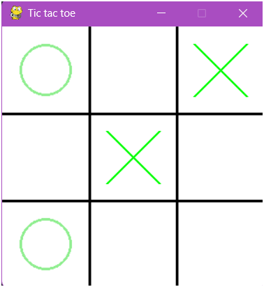
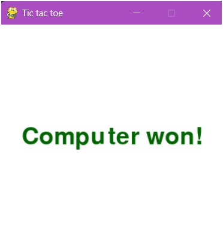

# Tic-Tac-Toe with Minimax AI

## Project Overview

This project implements the classic game of Tic-Tac-Toe, featuring an unbeatable AI opponent powered by the **Minimax algorithm**. The game allows a human player to compete against the AI, which makes optimal moves to either win or prevent the player from winning.

## Features

* **Human vs. AI Gameplay:** Play against an intelligent computer opponent.
* **Unbeatable AI:** The AI uses the Minimax algorithm to determine the best possible move, ensuring it never loses (it will either win or draw).
* **Clear Game Interface:** A simple and intuitive command-line (or GUI, if applicable) interface for playing the game.
* **Modular Code:** Designed with clear separation of concerns for game logic, AI logic, and user interface.

---
## User Interface

## Technologies Used
* **Python language**
* **Libraries - Pygame**
* **Algorithm - Minimax algorithm**

---

## How to Play

Choice 1. 
* On a desktop, download and play [Tic-tac-toe-AI](/app.exe).

Choice 2.
1. Install [python](https://www.python.org/downloads/).
2. Download and run [app.py](/app.py) file.

## Minimax Algorithm Explained

The core of this project's AI lies in the Minimax algorithm, a decision-making algorithm commonly used in game theory and artificial intelligence. It's a recursive algorithm that explores all possible game states from the current one to determine the optimal move.

* **Minimizer:** The AI's turn is considered the "minimizer" phase, where it tries to choose a move that leads to the smallest possible score (a win for the AI).
* **Maximizer:** The opponent's (human player's) turn is considered the "maximizer" phase, where the AI assumes the opponent will choose a move that leads to the highest possible score for the AI (a win for the opponent, or preventing an AI win).
* **Evaluation Function:** At the "leaf nodes" (end states of the game – win, lose, or draw), a score is assigned:
    * AI Win: `-1` (or a high positive number)
    * Human Win: `+1` (or a high negative number)
    * Draw: `0`
* **Recursion:** The algorithm recursively evaluates moves, propagating scores back up the game tree, with the maximizer picking the highest score from its children and the minimizer picking the lowest. The AI then chooses the move that leads to the maximum score at the initial decision point.

For Tic-Tac-Toe, due to its small game tree, Minimax can explore all possibilities, making the AI truly unbeatable.

---
## Contact

### **Sanskriti Gupta** 
* LinkedIn: [sanskriti-gupta-uno](https://www.linkedin.com/in/sanskriti-gupta-uno/)
* Or mail at: sanskriti12340@gmail.com